我想用 rust 寫一個類似 sqlite 的資料庫，稱為 sql4，版本如下

1. 先創建一個 B+tree 的模組
2. 讓這個 btree 版本，可以像 sqlite 那樣，選擇儲存在記憶體或硬碟。
3. 創建出和 sqlite 一樣的 API ，支援相同的 SQL 指令。
4. 讓該解譯器能利用 B+tree 來創建表格與索引。
5. 讓 sql 能支援全文檢索功能 (必須要同時支援 英語和 CJK 的檢索)




以下是 sql4 的建議程式碼組織架構，從目前的 B+Tree 模組逐步擴展成完整的資料庫引擎：建議的目錄結構如下：

```
sql4/
├── Cargo.toml
└── src/
    ├── lib.rs
    │
    ├── btree/          ✅ 已完成
    │   ├── mod.rs
    │   ├── node.rs     — Key, Record, Node 資料結構
    │   └── tree.rs     — insert / search / range / delete
    │
    ├── pager/          — 磁碟 I/O，頁面讀寫
    │   ├── mod.rs
    │   ├── pager.rs    — 開檔、讀寫頁面（4KB 頁）
    │   └── cache.rs    — LRU 頁面快取
    │
    ├── table/          — Row 與 Schema
    │   ├── mod.rs
    │   ├── schema.rs   — 欄位定義、型別（Int, Text, Bool…）
    │   ├── row.rs      — Row struct，欄位存取
    │   └── serialize.rs — Row ↔ Vec<u8> 序列化
    │
    ├── catalog/        — 資料庫的「資料字典」
    │   ├── mod.rs
    │   └── catalog.rs  — 管理所有 Table 的定義與索引清單
    │
    ├── parser/         — SQL 文字 → AST
    │   ├── mod.rs
    │   ├── lexer.rs    — 字元流 → Token 串
    │   ├── ast.rs      — Statement, Expr 等節點定義
    │   └── parser.rs   — Token 串 → AST
    │
    ├── planner/        — AST → 執行計畫
    │   ├── mod.rs
    │   ├── planner.rs  — 建立邏輯計畫
    │   └── executor.rs — 執行 SELECT / INSERT / DELETE
    │
    └── interface/      — 使用者介面
        ├── mod.rs
        └── repl.rs     — 互動式命令列（REPL）
```

---

**建議的開發順序**是由下往上：

1. **pager**：先讓資料可以讀寫磁碟，B+Tree 的節點池從記憶體換成真實頁面
2. **table/serialize**：定義 Row 結構，把 `Vec<u8>` value 對應到具名欄位
3. **catalog**：管理 Table 清單（`CREATE TABLE` 的結果存在這裡）
4. **parser**：解析 `SELECT / INSERT / CREATE TABLE` 等 SQL 語句
5. **planner/executor**：把 AST 接上 btree + catalog，讓查詢真正跑起來
6. **interface/repl**：最後加上互動式命令列，讓使用者可以直接輸入 SQL


